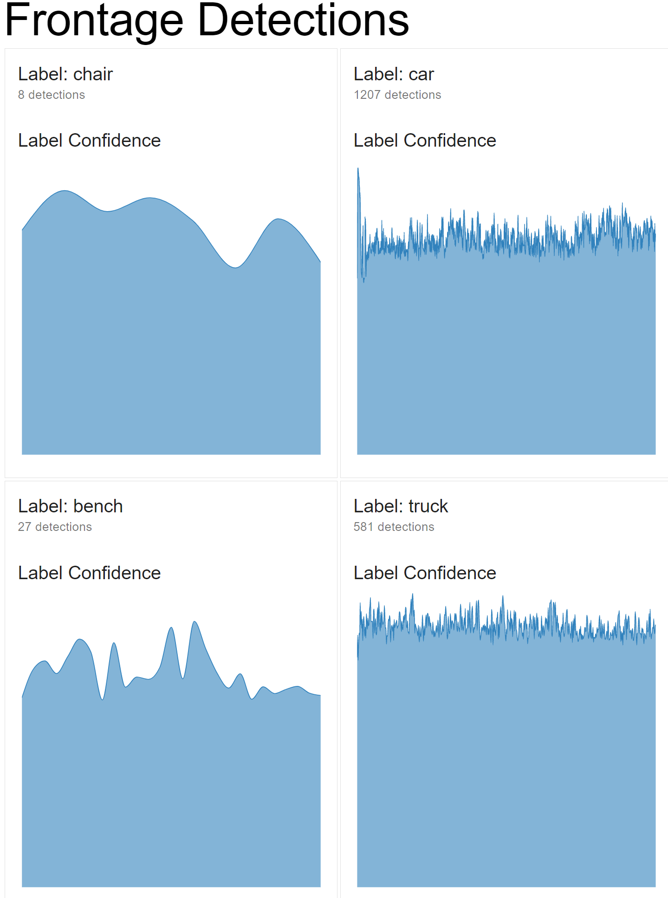

# Security Video Analysis

Converts a captured H.264 video into a series of JPEG frames. Objects can then be detected and classified in each frame. Finally, the resulting metadata JSON from the previsou step is uploaded to Firestore for the next phase of this project

# Prerequisites

* Install python modules `python -m pip install -r requirements.txt`
* Mount H.264 videos dataset to `/mnt/video`
* Mount an output path for analyzed videos to `/mnt/analysis`

## Troubles

### PIP: Firebase-Admin SegFault

Upgrade pip: `pip install --upgrade pip`

### TensorFlow: Core Dump

Verify CPU has AVX extensions: `cat /proc/cpuinfo` or whatever is right for windows.

You might be compiling on your own! https://www.tensorflow.org/install/source

Set aside about 24 hours for the compilation to complete.

# Using the Local Pipeline

```
video=/mnt/video//mnt/video/camera1-20200921T091843.1600705123.h264

./getFrames.sh $video
./runDetection.sh $video
./runIngestion $video

# Upload images if they are not already uploaded
./runUploadImages.sh /mnt/analysis/camera1/
```

# Ingest Metadata to Google Cloud

You'll need to install the [ Firebase SDK ](https://firebase.google.com/docs/firestore/quickstart) for this part.

```
video=/mnt/video//mnt/video/camera1-20200921T091843.1600705123.h264

./runIngestion.sh
```

# Running the UI

## Prerequisite

You'll need firebase credentials for the project.

```
npm install
npm start
```

Open a browser to http://localhost:1234

## Example

Chairs of the migratory variety...


## Building for Public Release (Production)

```
# Compile and minify JS to public/
npm run build
# Copy index.html to public/
npm run package
# Run a server to preview the compiled site (required docker)
npm run preview # http://localhost:8081 has compiled site
# Deploy to Firebase Hosting
npm run deploy
```

Optionally, clean-up cruft in `public/` with `npm run clean`.

# Plans

* Find events where there's no car in the driveway
* Find luminous events during dark videos
* Find events of optical transgression (dogs,people crossing the field of view)
* Find out who's speeding in the neighborhood by adding localization
